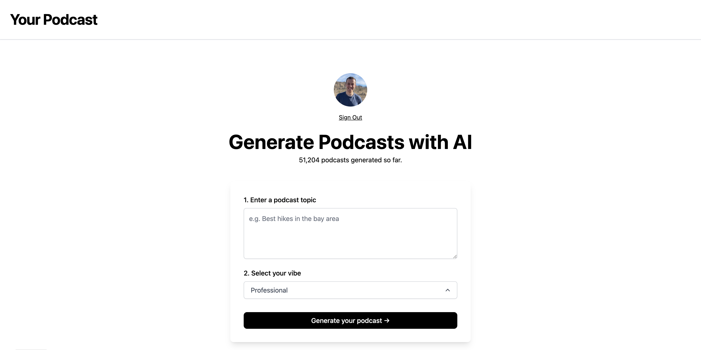

# [yourpodcast.xyz](https://www.yourpodcast.xyz/)

This project generates Podcasts using AI.

[](https://www.yourpodcast.xyz)

## How it works

## Running Locally

Then, install required npm packages:
```bash
npm install
```

Then, run the application in the command line and it will be available at `http://localhost:3000`.

```bash
npm run build
npm run dev
```

